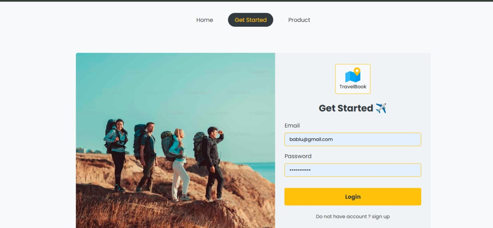
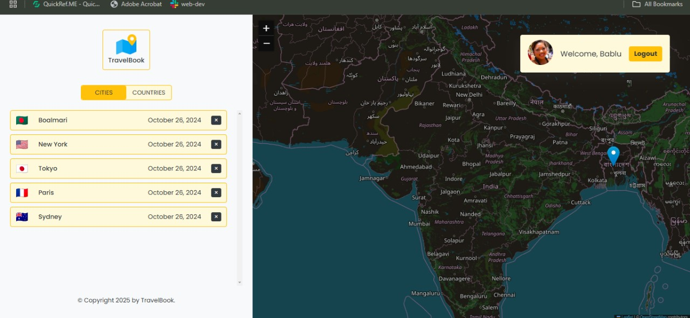

# React trevel Book

<div align="center">
<h4> React Travel Book helps travelers document their journeys by adding cities with experience notes. Featuring an interactive map powered by React Leaflet and OpenStreetMap, users can navigate, explore, and add cities directly on the map. Built with React, React Router v6, useReducer, and Context API, it offers a seamless way to capture travel experiences.</h4>

[](https://github.com/arpitjana21/SafarSathi-BookToursOnline)


[](https://opensource.org/license/mit/)

##


<br><br>

<br><br>



##

</div>

## Tech & Tools


## Getting Started

**Step 1** : Install `npm packages`

```
npm install
```

**Step 2** : Run

```
npm run dev
```

**Step 3** : Must have VS-Code Extentions

```
1. Prettier-Code formatter
2. ESLint
```

## Features

#### User and Admin Management:

1. Users can browse a list of cities using React-Router data-loading.
2. Add City-Form  functionality is implemented with leaflet Map.
3. city can be add or delete in the city list.
4. Orders can be searched by their ID using React-Router v6.
5. Tailwind CSS is used to create a modern and responsive design.

## Contact Me

[](https://github.com/bablubamaniya1007)
[](https://www.linkedin.com/in/bablubamaniya1007/)

## LISENSE

[](https://opensource.org/license/mit/)

<<<<<<< HEAD
Copyright (c) 2025 Bablu Bamaniya
=======
Copyright (c) 2025 Bablu Bamaniya
>>>>>>> db790d15ebf0e56303a75f1dcd5a9034ff155abe
